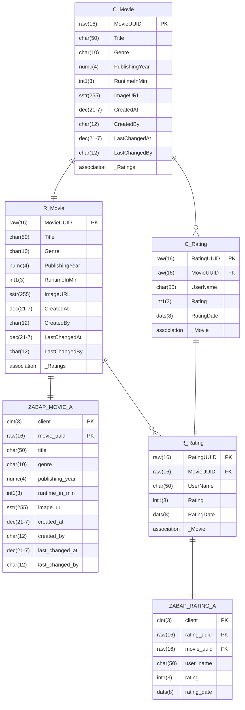

- Erstelle mit Hilfe des abgebildeten ER-Modells die BO Base View `ZR_???_Rating`
- Erweitere mit Hilfe des abgebildeten ER-Modells die BO Base View für Filme
- Erstelle mit Hilfe des abgebildeten ER-Modells für die BO Base View für Bewertungen die BO Projection View `ZC_???_Rating`
- Erweitere mit Hilfe des abgebildeten ER-Modells die BO Projection View für Filme
- Erweitere die Service Definition für Filme um Bewertungen
- Erstelle für die BO Projection View für Bewertungen die Metadata Extension `ZC_???_RATING`
- Erweitere die Metadata Extension für Filme um Bewertungen

## ER-Modell

## Hinweise zur Metadata Extension `ZC_???_RATING`

### Hinweise zum ListReport

- Als Tabellenüberschrift soll der Wert `Ratings` angezeigt werden
- Standardmäßig sollen die Spalten `UserName`, `Rating` und `RatingDate` angezeigt werden

### Hinweise zur ObjectPage

- Als Kopfzeilen-Titel soll der Wert des Feldes `Rating` angezeigt werden
- Als Kopfzeilen-Beschreibung soll der Wert des Feldes `UserName` angezeigt werden
- Die Felder `UserName` und `Rating` sollen in der Feldgruppe `Rating Details` angezeigt werden
- Die Felder `RatingUUID`, `MovieUUID` und `RatingDate` sollen in der Feldgruppe `Administrative Data` angezeigt werden
