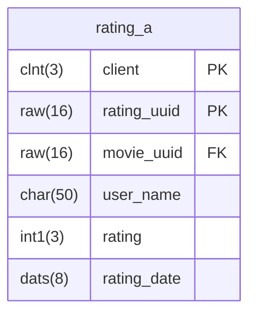
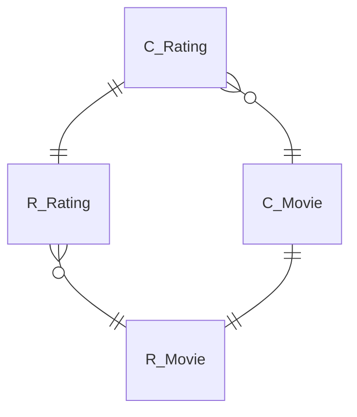

- Erstelle für die abgebildete Datenbanktabelle `ZABAP_RATING_A` die Restricted Interface View `ZR_???_Rating`
- Erweitere mit Hilfe des abgebildeten ER-Modells die Restricted Interface Views `ZR_???_Movie` und `ZR_???_Rating`
- Erstelle für die erstellte Restricted Interface View die Projection View `ZC_???_Rating`
- Erweitere mit Hilfe des abgebildeten ER-Modells die Projection Views `ZC_???_Movie` und `ZC_???_Rating`
- Erweitere die Service Definition `ZUI_???_MOVIE_V2` um die Projection View `ZC_???_Rating`
- Erstelle für die Projection View `ZC_???_Rating` die Metadata Extension `ZC_???_RATING`
- Erweitere die Metadata Extension `ZC_???_MOVIE` um Bewertungen

## Datenbanktabelle `ZABAP_RATING_A`

## ER-Modell

## Hinweise zur Metadata Extension `ZC_???_RATING`

### Hinweise zum ListReport

- Als Tabellenüberschrift soll der Wert `Ratings` angezeigt werden
- Standardmäßig sollen die Spalten `UserName`, `Rating` und `RatingDate` angezeigt werden

### Hinweise zur ObjectPage

- Als Überschrift soll der Wert `Rating` angezeigt werden
- Als Kopfzeilen-ID soll der Wert des Feldes `Rating` angezeigt werden
- Als Kopfzeilen-Beschreibung soll der Wert des Feldes `UserName` angezeigt werden
- Die Felder `UserName` und `Rating` sollen in der Feldgruppe `Rating Details` angezeigt werden
- Die Felder `RatingUUID`, `MovieUUID` und `RatingDate` sollen in der Feldgruppe `Administrative Data` angezeigt werden
