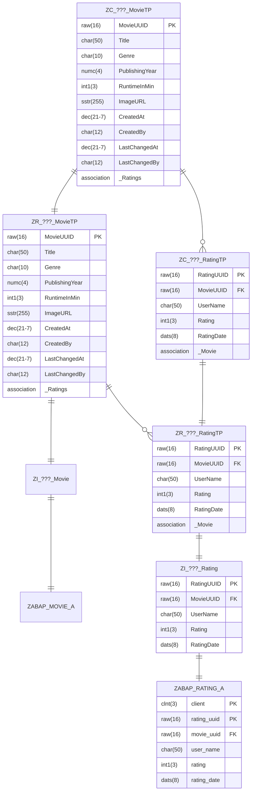

- Erstelle mit Hilfe des abgebildeten ER-Modells die Basic Interface View `ZI_???_Rating` sowie die BO Base View `ZR_???_RatingTP`
- Erweitere mit Hilfe des abgebildeten ER-Modells die BO Base View `ZR_???_MovieTP`
- Erstelle mit Hilfe des abgebildeten ER-Modells die BO Projection View `ZC_???_RatingTP`
- Erweitere mit Hilfe des abgebildeten ER-Modells die BO Projection View `ZC_???_MovieTP`
- Erweitere die Service Definition `ZUI_???_MOVIE` um die BO Projection View `ZC_???_RatingTP`
- Erstelle für die BO Projection View `ZC_???_RatingTP` die Metadata Extension `ZC_???_RATINGTP`
- Erweitere die Metadata Extension `ZC_???_MOVIETP` um die Anzeige von Bewertungen

## ER-Modell

## Hinweise zur Metadata Extension `ZC_???_RATINGTP`

### Hinweise zum ListReport

- Als Tabellenüberschrift soll der Wert `Ratings` angezeigt werden
- Standardmäßig sollen die Spalten `UserName`, `Rating` und `RatingDate` angezeigt werden

### Hinweise zur ObjectPage

- Als Kopfzeilen-Titel soll der Wert des Feldes `Rating` angezeigt werden
- Als Kopfzeilen-Beschreibung soll der Wert des Feldes `UserName` angezeigt werden
- Die Felder `UserName` und `Rating` sollen in der Feldgruppe `Rating Details` angezeigt werden
- Die Felder `RatingUUID`, `MovieUUID` und `RatingDate` sollen in der Feldgruppe `Administrative Data` angezeigt werden
