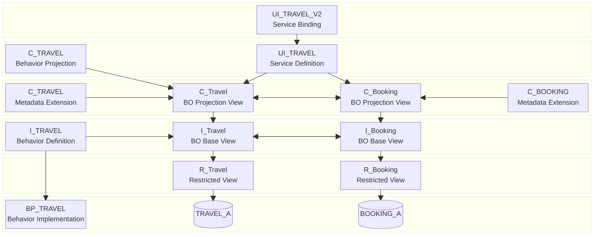

Diese Kochbuch stellt eine Schritt-für-Schritt-Anleitung zur Entwicklung einer transaktionalen SAP Fiori elements App zur Verwaltung von Reisen und den dazugehörigen Buchungen auf Grundlage des ABAP RESTful Application Programming Models (RAP) dar.

## ER-Modell

## Laufzeitartefakte

## Entwicklungsobjekte

| Kategorie           | Unterkategorie        | Entwicklungsobjekt   | Anmerkungen                       |
| ------------------- | --------------------- | -------------------- | --------------------------------- |
| Authorizations      | Authorization Fields  | ZAGENCY_ID           | Berechtigungsfeld Reisebüronummer |
| Authorizations      | Authorization Objects | ZAGENCY              | Berechtigungsobjekt Reisebüro     |
| Business Services   | Service Bindings      | ZUI_TRAVEL_V2        | Service Binding Reise             |
| Business Services   | Service Bindings      | ZUI_TRAVEL_V4        | Service Binding Reise             |
| Business Services   | Service Definitions   | ZUI_TRAVEL           | Service Definition Reise          |
| Core Data Services  | Access Controls       | ZC_TRAVEL            | Zugriffskontrolle Reise           |
| Core Data Services  | Access Controls       | ZR_TRAVEL            | Zugriffskontrolle Reise           |
| Core Data Services  | Behavior Definitions  | ZC_TRAVEL            | Behavior Projection Reise         |
| Core Data Services  | Behavior Definitions  | ZI_TRAVEL            | Behavior Definition Reise         |
| Core Data Services  | Data Definitions      | ZA_BookingFee        | Abstract View Buchungsgebühr      |
| Core Data Services  | Data Definitions      | ZC_Booking           | BP Projection View Buchung        |
| Core Data Services  | Data Definitions      | ZC_Travel            | BO Projection View Reise          |
| Core Data Services  | Data Definitions      | ZI_CustomerText      | Interface View Kundenname         |
| Core Data Services  | Data Definitions      | ZI_CustomerVH        | Interface View Kunde              |
| Core Data Services  | Data Definitions      | ZI_StatusVH          | Interface View Status             |
| Core Data Services  | Data Definitions      | ZI_Booking           | BO Base View Buchung              |
| Core Data Services  | Data Definitions      | ZI_Travel            | BO Base View Reise                |
| Core Data Services  | Data Definitions      | ZR_Booking           | Restricted View Buchung           |
| Core Data Services  | Data Definitions      | ZR_Travel            | Restricted View Reise             |
| Core Data Services  | Metadata Extensions   | ZC_BOOKING           | Metadata Extension Buchung        |
| Core Data Services  | Metadata Extensions   | ZC_TRAVEL            | Metadata Extension Reise          |
| Dictionary          | Database Tables       | Z_BOOKING_A          | Anwendungstabelle Buchung         |
| Dictionary          | Database Tables       | Z_TRAVEL_A           | Anwendungstabelle Reise           |
| Dictionary          | Database Tables       | Z_BOOKING_D          | Entwurfstabelle Buchung           |
| Dictionary          | Database Tables       | Z_TRAVEL_D           | Entwurfstabelle Reise             |
| Source Code Library | Classes               | ZCL_TRAVEL_GENERATOR | ABAP-Klasse Reise-Generator       |
| Source Code Library | Classes               | ZCM_TRAVEL           | Nachrichtenklasse Reise           |
| Source Code Library | Classes               | ZBP_TRAVEL           | Verhaltensimplementierung Reise   |
| Texts               | Message Classes       | Z_TRAVEL             | Message Class Reise               |

