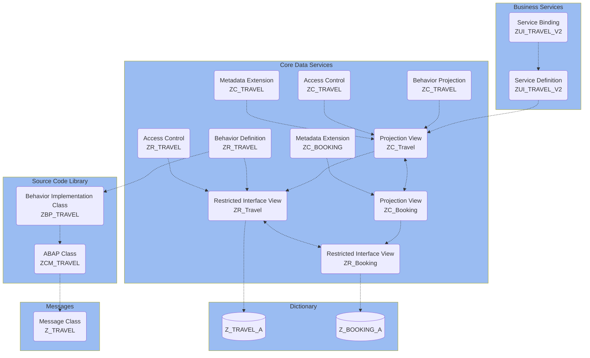

Diese Kochbuch stellt eine Schritt-für-Schritt-Anleitung zur Entwicklung einer transaktionalen SAP Fiori elements App zur Verwaltung von Reisen und den dazugehörigen Buchungen auf Grundlage des ABAP RESTful Application Programming Models (RAP) dar. Im Rahmen der Entwicklung werden Schritt für Schritt die nachfolgend dargestellten Laufzeitartefakte erstellt und erweitert:

